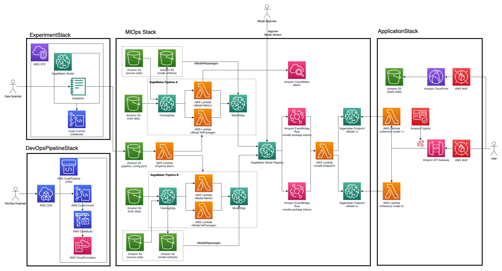

# MLOps Prototype project for Recommendation models

Build MLOps pipeline for recommendation ML models.

## 1. Overview
* Setup ML experiment environments on Amazon SageMaker Studio
* Build MLOps pipeline with model serving
* Monitoring model metrics
* Real-time inference endpoint


### 1.1 Documents
* [MLOps Pipeline Architecture](./docs/mlops_architecture.md)
* [Standardize Repositories and Data Structure](./docs/data_governance.md)

## 2. Quick Setup
Project deployments are tested on Linux/MacOS environments.

### 2.1 Pre-requirements
* node.js : 20.x or higher
* git : 2.x or higher
* python : 3.9 or higher
* boto3 : latest
* aws-cli : latest
* git-remote-codecommit : latest

### 2.2 Project Config
Edit config files in ```/packages/infra/config```
* default.yml
* test.yml

### 2.3 AWS Account
Create IAM user os SSO user with IAM Identity Center.
* (option 1) If you already configured ```aws profile```
```
export AWS_PROFILE=<your-profile-name> 
```
* (option 2) With secret key and secret access key
```
export AWS_ACCESS_KEY_ID=<your-access-key>
export AWS_SECRET_ACCESS_KEY=<your-secret-access-key>
export AWS_DEFAULT_REGION=ap-northeast-2
```

### 2.4 Tool install
* Install boto3, git-remote-codecommit
```
pip install -U boto3
pip install -U git-remote-codecommit
```

* Install AWS CDK, AWS PDK
```
npm install -g aws-cdk @aws/pdk pnpm
```

### 2.5 Project dependency install
```
pnpm install
pdk
pdk build
```

### 2.6 (optional) CDK Bootstrap
If you have not been deployed AWS CDK application in the AWS accout, you have to bootstrap CDK Toolkit.
```
pushd packages/infra
cdk bootstrap
popd
```

### 2.7 Deploy DevOps Pipeline
```
pushd packages/infra
cdk deploy --all --require-approval never
popd
```

### 2.8 Upload project code to code commit
After DevOpsPipeline deployed, you can show codecommit repository url in CloudFormation outputs.
```
git init
git remote add origin <your-code-commit-reporitory-url>
git add .
git commit -m "initial commit"
git push -u origin main
```

### 2.9 Check Pipeline status
You can deploy status in AWS CodePipeline or AWS CloudFormation console.

## 3. License
* MIT-0
