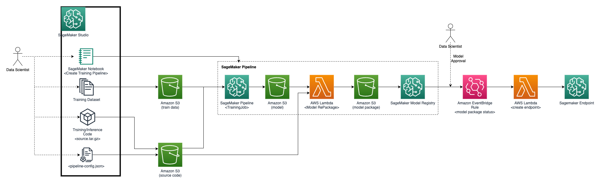

# MLOps Pipeline Architecture

## 1. MLOps Pipeline Architecture
* ExperimentStack : SageMaker Studio environment to build model for datascientists
* MLOpsStack : MLOps orchastration. Training and Model deployments.
* ApplicationStack : HTTP endpoint for inference and web application for demo.
* DevOpsPipelineStack : CI/CD integration for mlops project


## 2. Dataflow Diagram
1. Data scientist construct SageMaker Pipeline for training model
1. Data scientist upload training data to S3 bucket
1. Data scientist upload training/inference code to S3 bucket
1. Data scientist write ```pipeline-config.json`` to execute pipeline, and upload it to S3 bucket
1. SageMaker Pipeline started. SageMaker TrainingJob store model file(```model.pth```) as a result on S3 bucket
1. A Lambda function repackage model output
    * Download inference code(```inference.py```), and model output file(```model.pth```)
    * unzip code and model output
    * merge these files as SageMaker Inference Toolkit source structure
    * zip merged file
    * upload merged zip file to S3 bucket(repackage)
1. The model registred on SageMaker Model Registry on 'Pending Approval' status
1. Model Approver approve the model version
1. EventBridge rule detect status change and execute Lambda function
1. Lambda create SageMaker Endpoint to inference model
